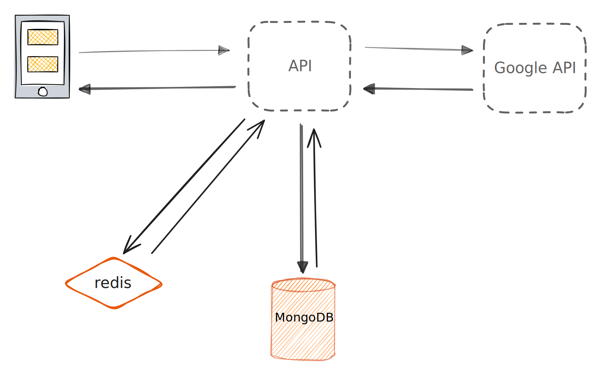

## 1. Use cases

- **Service** has authentication and authorization
- Data sync
- **User** sees a list of venues
- **User** sees a list of review

## 2. High level design



## 3. Core components

### Use case: Service has authentication and authorization

#### User signup

- Enters email, password to register new account
- System validates input data
- System checks if username already exists
- System hashes password and stores user entry in database
- System sends confirmation email to user

```
POST https://domain.com/api/v1/signup
```

Response:

```
{
    "message": "Signup successful",
    "user": {
        "_id": "[unique id]",
        "email": "example@example.com",
        "password": "[password]",
    }
}
```

#### User login

- User enters email & password
- System validates email exists
- System checks password hash matches stored hash
- System return token

```
POST https://domain.com/api/v1/login
```

Response:

```
{
  token: "[Bearer token]",
  refresh_token: ""
}
```

```
GET https://domain.com/api/v1/profile
```

Response:

```
{
  user: {
    _id: "[unique id]",
    email: "example@example.com",
    role: "admin"
  },
}
```

#### User link Google business account

- User clicks `Link` button
- System redirect User to OAuth page
- System save Google access_token, refresh_token, expire after processing OAuth
- Redirects user to Dashboard

#### User logout

- User clicks logout link
- Delete the token from client
- System invalidate the token
- Redirects user to login page

#### Manage user permissions

- Limit permissions based on user roles

### Use case: User sees a list of venues

The logged in User must link to a Google business account. Assume that the User has linked & enabled Google Business API.
We'll use a table `venues` to store processed data fetched.

- The **Client** sends a request to the **API Server**

- The **API** server does the following:
  - Check if the User had been fetch Venues data before (Count the records, check the `last_fetch_time`)
  - If the data is up to date, return from **Cache**
  - If the data must be fetch/re-validate:
    - Make sure the Google token is still valid, otherwise ask the user to re-link
    - Parses the query
    - Get the User's Google account id
    - Make a Request to `GET https://mybusiness.googleapis.com/v4/{parent=accounts/*}/locations` with the parsed query parameter
    - Process the return data from **Google API**, save it to **MongoDB**, update data in **Cache**
    - Return data

```
GET https://domain.com/api/v1/venues?s=&sortBy=last-publication
```

Response:

```
{
  data: [
    {
      "_id": "1zc99...",
      "title": "Starbucks Coffee",
      "image": "image.png",
      "address": "1385 Metropolitan Ave",
      "star": "4.3",
      "review": "232",
      "last_publication": "2014-10-02T15:01:23Z",
      "last_fetch_time": "2014-10-02T15:01:23Z"
    },
    {
      "_id": "1zc99...",
      "title": "Starbucks Coffee",
      "image": "image.png",
      "address": "1385 Metropolitan Ave",
      "star": "4.3",
      "review": "232",
      "last_publication": "2014-10-02T15:01:23Z",
      "last_fetch_time": "2014-10-02T15:01:23Z"
    },
    {
      "_id": "1zc99...",
      "title": "Starbucks Coffee",
      "image": "image.png",
      "address": "1385 Metropolitan Ave",
      "star": "4.3",
      "review": "232",
      "last_publication": "2014-10-02T15:01:23Z",
      "last_fetch_time": "2014-10-02T15:01:23Z"
    },
  ],
  total: 6,
  current_page: 1,
  last_page: 2
}
```


### Use case: User sees a list of reviews

The logged in User must link to a Google business account. Assume that the User has linked & enabled Google Business API.
We'll use a table `reviews` to store processed data fetched.

- The **Client** sends a request to the **API Server**

- The **API** server does the following:
  - Check if the User had been fetch Questions data before (Count the records, check the `last_fetch_time`)
  - If the data is up to date, return from **Cache**
  - If the data must be fetch/re-validate:
    - Make sure the Google token is still valid, otherwise ask the user to re-link
    - Parses the query
    - Get the User's Google account id
    - Make a Request to `GET https://mybusiness.googleapis.com/v4/{name=accounts/*/locations/*/reviews/*}` with the parsed query parameter
    - Process the return data from **Google API**, save it to **MongoDB**, update data in **Cache**
    - Return data

```
GET https://domain.com/api/v1/reviews?s=&sortBy=last-edited
```

Response:

```
{
  data: [
    {
      "_id": "1zc98...",
      "venues": "Starbuck",
      "reviews": [
        {
          "_id": "...",
          "reviewer": {
            "displayName": "Katarina CrownGuard",
            "profilePhotoUrl": "https://image.com",
            "isAnonymous": true
          }
          "starRating": "FOUR",
          "comment": "Comment...",
          "reviewReply": {
            "comment": "We are sorry to hear about your experience at our coffee shop..",
            "updateTime": "2014-10-02T15:01:23Z"
          },
          "createTime": "2014-10-02T15:01:23Z",
          "last_fetch_time": "2014-10-02T15:01:23Z"
        },
        {
          "_id": "...",
          "reviewer": {
            "displayName": "Katarina CrownGuard",
            "profilePhotoUrl": "https://image.com",
            "isAnonymous": true
          }
          "starRating": "FOUR",
          "comment": "Comment...",
          "reviewReply": {
            "comment": "We are sorry to hear about your experience at our coffee shop..",
            "updateTime": "2014-10-02T15:01:23Z"
          },
          "createTime": "2014-10-02T15:01:23Z",
          "last_fetch_time": "2014-10-02T15:01:23Z"
        }
      ]
    },
    {
      "_id": "1zc99...",
      "venues": "Starbuck",
      "reviews": [
        {
          "_id": "...",
          "reviewer": {
            "displayName": "Katarina CrownGuard",
            "profilePhotoUrl": "https://image.com",
            "isAnonymous": true
          }
          "starRating": "FOUR",
          "comment": "Comment... ",
          "reviewReply": {
            "comment": "We are sorry to hear about your experience at our coffee shop..",
            "updateTime": "2014-10-02T15:01:23Z"
          },
          "createTime": "2014-10-02T15:01:23Z",
          "last_fetch_time": "2014-10-02T15:01:23Z"
        },
      ]
    },
  ],
  total: 6,
  current_page: 1,
  last_page: 2
}
```

### Use case: Data sync

User can get newest content by manually clicking on a `Sync` button, OR it can be done automatically using Pub/Sub:
- Create a Pub/Sub Topic
- Subscribe to Notifications
- Listen for messages
- Update the data


## Models
```js
model User {
  id        String  @id @default(autoincrement()) @map("_id") @db.ObjectId
  email     String  @unique @db.VarChar(255)
  password  String  @db.VarChar(255)
  role     String

  account Account
  venue Venue[]
}

model Account {
  id                String  @id @default(autoincrement()) @map("_id") @db.ObjectId
  userId            String  @db.ObjectId
  type              String
  provider          String
  prodiverAccountId String
  refresh_token     String? @db.String
  access_token      String? @db.String
  expires_at        Int?
  token_type        String?
  scope             String?
  id_token          String @db.String
  session_state     String?

  user User @relation(...)
}

model Venue {
  id               String  @id @default(autoincrement()) @map("_id") @db.ObjectId
  title            String
  image            String
  address          String
  star             String
  review           String
  last_publication DateTime
  last_fetch_time  DateTime

  user  User  @relation(...)
  userId  String
  reviews Review[]
}

model Review {
  id              String  @id @default(autoincrement()) @map("_id") @db.ObjectId
  reviewer        Reviewer
  starRating      String
  comment         String
  reviewReply     ReviewReply?
  createTime      DateTime
  last_fetch_time DateTime

  venue           Venue @relation(...)
  venueId         String
}

model Reviewer {
  id              String  @id @default(autoincrement()) @map("_id") @db.ObjectId
  displayName     String
  profilePhotoUrl String
  isAnonymous     Boolean

  review          Review @relation(...)
  reviewId        String
}

model ReviewReply {
  id         String @id @default(autoincrement()) @map("_id") @db.ObjectId
  comment    String
  updateTime DateTime

  review     Review   @relation(...)
  reviewId   String   @unique
}
```
